> This page explains advanced features, some players may not understand everything in this page.
{.is-warning}

> This page *should* be up to date with Wubby V8!
{.is-success}

Wubby Logic is the second-most important thing in your wubby worlds, They can do mostly anything such as changing block colors, moving blocks, and even custom NPC movement!

Here are some useful links for wiring:
- [Easing functions *Contains most easing types with directions.*](https://easings.net/)
{.links-list}
# <i class="fa-duotone fa-inbox-in"></i> Input
These are blocks that are used to power wiring systems. They do not receive wiring inputs, and can only output.
## {.tabset}
### Block Touch Detector
Emits a signal when touched by an unachored block or gear debris.
Output: The part that touched it.
Configurations:
- Activation Time: How long it activates for. Default is 1
- Anchor Type: Decides what blocks get detected. Default is NonAnchored
- Color To Filter: When filter color is true, only blocks with this color will trigger it. Default is pearl.
- Filter Color: Whether if this block will only trigger when a block with the specified color touches it. Default is false.

### Click Block
Emits a signal when clicked on. 
Output: The player's username.
Configurations: 
- Activation Time: How long it activates for. Default is 1. 
- Max Distance: How far you can click this block. Default is 32.
- Toggleable: Whether if this block acts like a switch. Default is true.

### Humanoid State Block
Emits a signal when a humanoid changes to the specified state.
Output: The player's username.
Configurations:
- Activation Time: How long it activates for. Default is 1.
- State: The block fires when a humanoid enters this state. Default is Landed.
- Use Activation Time: If this is off, then the block will only stop firing once the humanoid exits the state. Default is true.

### Key Input Block
Emits a signal when a player presses the selected key or mobile button.
Output: The player's username.
Configurations:
- Activation Time: How long it activates for. Default is 1.
- Input Detection Type: Determines if the block will fire if the input ended, or started.
- Use Activation Time: When this is off, the block will only stop firing once the player releases the key. This can only be turned off if the "Input Detection Type" is set to "InputStarted", otherwise this setting will be forced.
- Mobile Button Enabled: If this is on, touchscreen players will get a button on their screen that activates the block.
- Mobile Button Position: The [UDIM2](https://create.roblox.com/docs/reference/engine/datatypes/UDim2) position (possibly scale) of the mobile button on a players screen if "Mobile Button Enabled" is on.
- Mobile Button Text: What the text on the block's mobile button will be if "Mobile Button Enabled" is on.

### NPC Event Block
Emits a signal once the an NPC does the selected NPC event.
Output: The NPC's NPC Block.
- Activation Time: How long it activates for. Default is 1.
- Event: The NPC Event to detect.

### Player Chatted Block
Emits a signal every time a player chats.
Output: Either the player's username or what they said depending on the "Output Type" setting.
Configurations:
- Activation Time: How long it activates for. Default is 1.
- Output Type: Determines if the block will output the players chat message or their username when its fired. Default is "Message".

### Player Event Block
Emits a signal when the selected player event is triggered.
Output: The player's username
- Activation Time: How long it activates for. Default is 1.
- Event: The Player Event to detect.

### Player Touch Detector
Emits a signal when a Player/NPC touches this block.
Output: The player's username. (If Detect is set to "NPC" it always outputs the NPC Block)
Configurations:
- Activation Time: How long it activates for. Default is 1.
- Detect: A dropdown menu with the items: Players, NPCs, Everything.
- Use Activation Time: When this is off, the block will only stop firing once the Player/NPC stops touching the block.

### Prompt Block
Emits a signal when it's Proximity Prompt has been triggered.
Output: The player's username.
Configurations:
- Activation Time: How long it activates for. Default is 1.
- Hold Duration: Amount of time to trigger the prompt. Default is 0.5
- Key: Key to hold when triggering the prompt. Default is E.
- Toggleable: Whether if this block acts like a switch. Default is true.

### Shop Event Block
> **Keep this input parallel to reduce chances of failing.**
{.is-warning}

Emits a signal when the specified item name is bought.
Output: Player Username
- Activation Time: How long it activates for. Default is 1.
- Item Name: The item to detect a purchase on.

### Tap Input Block
Emits a signal when a player presses a mouse button.
Output: The player's username.
- Activation Time: How long it activates for. Default is 1.
- Input Detection Type: Determines if the block will fire if the input ended, or started.
- Key: What mouse button is being interacted with.
- Use Activation Time: When this is off, the block will only stop firing once the Player stops giving inputs. (Will be turned On if Input Detection Type is "InputEnded")

# <i class="fa-duotone fa-microchip"></i> Logic
These are blocks that allow a player with build permissions to add extra functionality to their world, these examples include:
- <kbd>Shift</kbd> to sprint
- <kbd>E</kbd> to activate ability

and etc.
> An input is where the gate recieves a signal from a wire connected to it
> An output is where the gate sends a signal to a wire connected from it
>
> "true" = active signal
> "false" = inactive signal
> **This is known as a bool.**
{.is-info}

> the gate descriptions are in-progress and may be incorrect, if you find any incorrect circuits please use the [wiki feedback form](https://forms.gle/8szUe2x9H9t8gfYq7).
{.is-warning}

## {.tabset}

### AND Gate
Checks whether if both inputs are active. (they do not check if the values are the same)
Input: 2 values (any)
Output: Bool

*Example Circuit:*
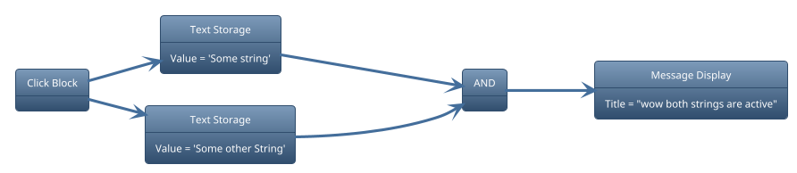
*Expected Output: "wow both strings are active" (chat)*
### BOOL SETTER Gate
Sets a BOOL STORAGE to the set bool value.
Input: none
Output: none
- Value: The Bool Value to set a BOOL STORAGE to.

*Example Circuit:*
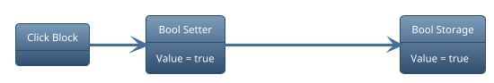
*Expected Output: the bool storage's value should be true*
### BOOL STORAGE Gate
Stores a bool value
Input: Bool
Output: Stored Value
- Delay Before Output: Seconds to wait before outputting.
- Save Value: ??? (presumambly decides whether value is saved on world restart)
- Value: The stored value.

*Example Circuit:*
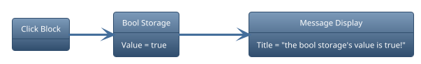
*Expected Output: "the bool storage's value is true!" (chat)*
### BOOL SWITCH Gate
Inverts / Switches the value of a BOOL STORAGE Gate
Input: none
Output: none

*Example Circuit:*

*Expected Output: the bool storage should be the opposite value*
### BREAK VECTOR Block
Gets a specified axis of a [Vector3](https://create.roblox.com/docs/reference/engine/datatypes/Vector3)
Input: Vector3
Output: Number (none if Input is not a vector3)
- Axis: The axis to get from the input.

*Example Circuit:*
*for this example "Block" will be placed at (10, 2, 41)*
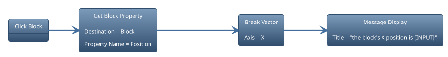
*Expected Output: "the block's X position is 10" (chat)*
### BUILD VECTOR Block
Combines the X, Y, and Z Properties to form a Vector3.
Input: any (Number if gate uses {INPUT})
Output: Vector3
- X: The X Axis of the Vector3
- Y: The Y Axis of the Vector3
- Z: The Z Axis of the Vector3

*Example Circuit:*
*for this example "Block" can be placed anywhere*
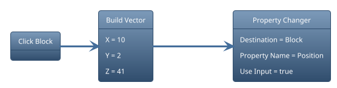
*Expected Output: Block will move to 10, 2, 41.*
### CHANGE SIGNAL Block
> The Property can be changed in the "Types" Tab in Properties
{.is-info}

Changes the signal into the selected property.
Input: any (Ignored)
Output: any
- Selected Property: The property type to change into.

*Example Circuit:*
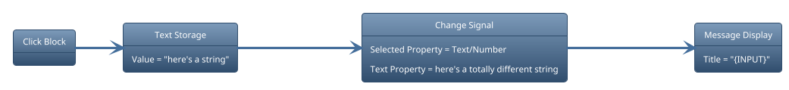
*Expected Output: "here's a totally different string" (chat)*
### DELAY Gate
Delays the signal by X seconds. (equivalent of `wait()`)
Input: any
Output: any (same as Input)
- Delay: The amount of time to delay.
- Ignore Deactivation: Determines if the gate will stop its signal when the previous gate stopped sending its signal

### GET BLOCK PROPERTY
Gets a property of the specified block.
Input: any (Block if Destination is not set)
Output: any (The type of the retrieved property)
- Property Name: The property to retrieve.
- Destination: The block to get the properties from.

*Example Circuit:*
*for this example "Block" will be placed at (17, 9, 8)*
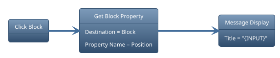
*Expected Output: "17 9 8" (chat)*
### GET GAME PROPERTY Gate
Gets a property of the world.
Input: any (Type Needed Differs)
Output: any (The type of the retrieved property)
- Property Name: The property to retrieve.
- Value: ??

*Example Circuit:*
*(this applies to most game properties)*
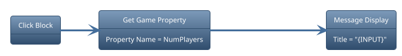
*Expected Output: "\[number of players\]" (chat)*

Depending on the chosen property the Input may need to be a specific type.
- NumPlayersOnTeam: Requires a team name as input.
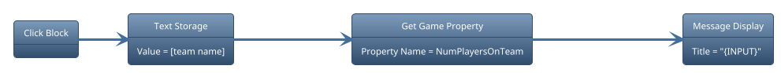
- IsPlayerOnServer: Requires a username as input.
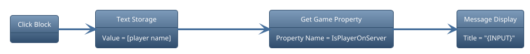
- TotalColoredBlocks: Requires a color as input.
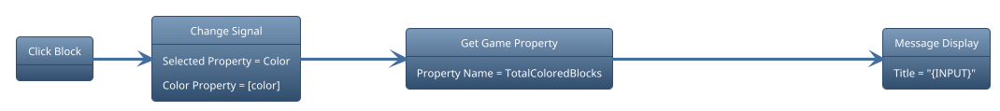

### GET NPC PROPERTY Gate
Gets a property of the specified NPC Block.
Input: any (NPC Block if no Destination is set)
Output: any (The type of the retrieved property)
- Property Name: The property to retrieve.
- Destination: The NPC Block to get the properties from.

*Example Circuit:*
*place an NPC block and set the NPC's name as "goober"*
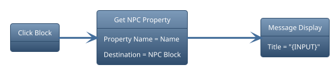
*Expected Output: "goober" (chat)*
### GET PLAYER PROPERTY Gate
Gets a property of the specified player.
Input: Player Username
Output: any (The type of the retrieved property)
- Property Name: The property to retrieve.

*Example Circuit: TODO*
### GET STAT Gate
Gets the stat of the specified player.
Input: Player Username
Output: Number

- Stat Name: The stat to retrieve.

*Example Circuit: TODO*
### IF Gate
Checks if the inputted value is the same as Value
Input: any
Output: Bool
- Check Type: How the value is compared.
- Keep Activation: Determines if the gate will stop its signal when the previous gate stopped sending its signal
- Value: The value to compare the Input to.

*Example Circuit:*
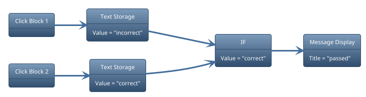
*Expected Output: "passed" (chat) if you pressed click block 2*
### LOOP THROUGH EVERYONE Gate
When Powered, The gate will loop through every player in the world.
Input: any
Output: Player Username
- Active Time: How long each loop takes. (seconds)
- Delay: How long to wait for another loop. (seconds)
- Loop Type: Determines if it loops through NPCs or Players.

*Example Circuit:*
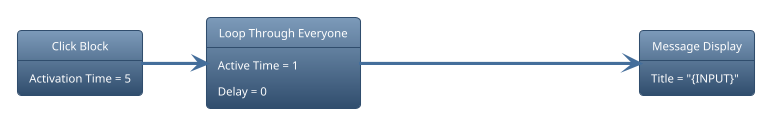
*Expected Output: all players in the world's usernames in chat*
### MATH Gate
Does a math operation on the Input.
Input: Number
Output: Number
- Math Order: Determines if the Input is before the Value and vice versa.
- Operation Type: The operation to do.
- Next Gate Type: Determines if the output needs to go through a NUMBER STORAGE to complete an operation.
- Disable Output: Determines if a connected NUMBER STORAGE outputs its value after this gate output.
- Value: The value to calculate the Input with.

*Example Circuit:*
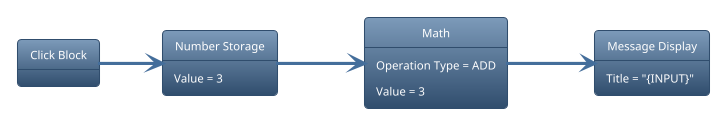
*Expected Output: "6" (chat)*
### NOT Gate
Inverts or "Flips" the signal.
Input: any
Output: any (Bool probably??)

*Example Circuit: TODO*
### NUMBER SETTER Gate
> Use `<minimumNumber>`, `<maximumNumber>` as the value to randomly generate a number between `<minimumNumber>` and `<maximumNumber>`.
>
> An example would be creating a Random Number Generator (RNG).
{.is-info}

Sets the value of a NUMBER STORAGE Gate
Input: any (Number if using Input)
Output: none
- Disable Output: Determines if a connected NUMBER STORAGE outputs its value after this gate output.
- Value: The value to store the NUMBER STORAGE.

*Example Circuit: TODO*
### NUMBER STORAGE Gate
Stores a number value.
Input: Number
Output: Number
- Delay Before Output: Seconds to wait before outputting.
- Save Value: ??? (presumambly decides whether value is saved on world restart)
- Value: The stored value.

*Example Circuit: TODO*
### OR Gate
If 1 or more signals connected to this gate, this gate will fire.
Input: Number
Output: bool

*Example Circuit: TODO*
### REPEATER Gate
Repeatedly sends a signal, How it's sent depends on the loop type.

- Activation time: how long the signal will last until it loops back again.
- Delay: how long to wait before the next loop starts
- Loop type: how the repeater will behave
- Start index: the starting number the repeater will use
- Finish index: the ending number the repeater will use

*Example Circuit: TODO*
### SET STAT Gate
Sets the stat of the input and outputs the stat's value
Input: Player Username
Output: Number
- Operation Type: Set, add or subteact the stat value.
- Stat name: The stat name to set.
- Value: The new value to set (or add / subtract) the stat.

*Example Circuit: TODO*
### TEXT EDITING Gate
Sets the value of the connected TEXT STORAGE.
Input: any
Output: none (String if Next Gate Type is Normal)
- Next Gate Type: Decides if it can go through only a TEXT STORAGE or any gate.
- Disable Output: Determines if a connected TEXT STORAGE outputs its value after this gate output.
- Operation Type: Decides what to do with the value.
- Value: The value to set a TEXT STORAGE to. (Output if Next Gate Type is Normal)

*Example Circuit: TODO*
### TEXT INPUT Gate
Brings up a dialog box on the Input's screen and outputs the response.
Input: any
Output: String
- Cancel Button Disabled: Decides of if the Cancel / X Button shows up.
- Input Position: Changes the dialog's position.
- Input Size: Changes the dialog's size.

*Example Circuit: TODO*
### TEXT STORAGE Gate
Stores a text value that can be edited using a TEXT EDITING Gate.
Input: TEXT EDITING Signal
Output: String
- Delay Before Output: Seconds to wait before outputting.
- Save Value: ??? (presumambly decides whether value is saved on world restart)
- Value: The stored value.

*Example Circuit: TODO*
### TRIPLE MATH Gate
Special variant of the MATH Gate that uses vectors (x, y. z).
Input: Number
Output: Number
- Operation type: Decides what to do with the X, Y and Z numbers.
- X: X of the vector.
- Y: Y of the vector.
- Z: Z of the vector.

*Example Circuit: TODO*
### XOR Gate
Takes multiple signals and produces an output if the number of true inputs are odd.
Input: any (Multiple)
Output: Bool

*Example Circuit: TODO*
# <i class="fa-duotone fa-inbox-out"></i> Output
These wiring blocks carry out functions that usually dont return a output. They power the next gate AFTER they are finished with their function.
## {.tabset}
### Attach Block
> This output can be used with the Local Output block!
{.is-success}

Attaches parts to a player.
Input: Player Username
- Body Part: The Body part to attach the block onto.
- Cooldown: Amount of time before you can attach another block again. **(3s if the last person who edited wasnt the owner)**
- Offset: How offset the block are from the Body Part.
- Rotation: What rotation the block should be.
- Output Clone: Decides if it will output the first cloned block it made.
- Time Active: Amount of time the block stays on the player's body before despawning.
- Spawn Unanchored: Decides if the cloned block are unanchored.
- Use Time Active: Decides if it will use the Time Active Property.
- Block to Weld: The block to weld to the player.

*Example Circuit: TODO*
### Attribute Changer
Changes an attribute of a block.
Input: none (Block if destination is empty)
- Attribute Name: The attribute to change.
- Property Name: The attribute property to change.
- Destination: The block to change the attribute to.

*Example Circuit: TODO*
### Camera Block
Moves the Input's Camera to the specified position and rotation.
Input: Player Username
- Easing Direction: Decides the easing direction of the ease.
- Easing Style: The type of easing to use for the animation.
- Repeat Count: How many times to repeat the animation.
- Reverses: Decides if repeating reverses to the initial position.
- Animation Time: How long the animation takes.
- Target Position: Where to move the camera.
- Target Rotation: What rotation the camera should be.
- Time before returning: Amount of time before returning to the player.
- Use time: Decides if it uses Time before returning. **(Make sure to use the ':fix' command to return to your player)**

*Example Circuit: TODO*
### Clone Block
> This output can be used with the Local Output block!
{.is-success}

Clones the blocks inside it. If the input is a block, it will be used as a container for all the blocks that will be cloned.
Input: any
- Despawn Enabled: Decides if Despawn time will be used.
- Cooldown: Amount of time before you can attach another block again. **(3s if the last person who edited wasnt the owner)**
- Despawn Time: Amount of time before the blocks despawn.
- Output Clone: Decides if it will output the first cloned block it made.
- Spawn Unanchored: Decides if the cloned block are unanchored.
- Target Position: Where to put the cloned blocks.
- Target Rotation: What rotation the cloned blocks should be.

*Example Circuit: TODO*
### Command Block
> This output can be used with the Local Output block!
{.is-success}

> Be careful with this block as players can run any Builder+ commands. (so dont be dumb on about who you will perm.)
{.is-warning}

Runs a command like a normal player. 
Input: any
- Command: The command to run. **(Only Builder+ Commands can be run for obvious security reasons.)**

*Example Circuit: TODO*
### Message Display Block
> This output can be used with the Local Output block!
{.is-success}

Displays a message.
Input: any (Player Username if using SpecificPlayer)
- Affect: Controls who will see the message.
- Message Color: The color of the message.
- Description: The message description. Only works if the Message Type is set to Notification.
- Message Time: The time the message will be shown. Only works if the Message Type is set to Notification. Use 0 to calculate the message time. The input is 0 by default.
- Title: The title of the message. (Content if not using Shout.)
- Message Type: Changes how the message is displayed.
- Notification Image ID: The Image ID for the notification. Only works if the Message Type is set to Notification.

*Example Circuit: TODO*
### Path Block
Used with the NPC Block to control where the NPC goes.
Input: any (NPC Block if NPC property is empty)

- Custom Target: The player/NPC to walk to.
- Priority Mode: Controls how the NPC interprets the path.
- NPC: The NPC to control.

*Example Circuit: TODO*
### Property Changer
> This output can be used with the Local Output block!
{.is-success}

Changes a property of a block.
Input: any
- Easing Direction: Decides the easing direction of the ease.
- Easing Style: The type of easing to use for the animation.
- Platform Stand: Decides if the player can stand on the block while moving.
- Property Name: The property to change.
- Repeat Count: How many times to repeat the animation.
- Reverses: Decides if repeating reverses to the initial position.
- Animation Time: How long the animation takes.
- Destination: The block to change the properties of.
- Use Input: Decides if it uses the input or the defined type properties.

*Example Circuit: TODO*
### Wirer Block
Makes a temporary connection from the Input to the specified block.
Input: Block
- Connect Direction: Decides how they're connected.
- Operation: Decides if the connection will be created or removed.
- Connect to: The block to connect the Input to.

*Example Circuit: TODO*
### Wiring Variable Block
Makes a variable that you can use anywhere in the world. Syntax for variables are "{\[var name\]}"
Input: any
- Operation: Decides if it should create / set or remove the variable.
- Value: What to set the variable to.
- Variable Name: What the variable name should be.

*Example Circuit: TODO*